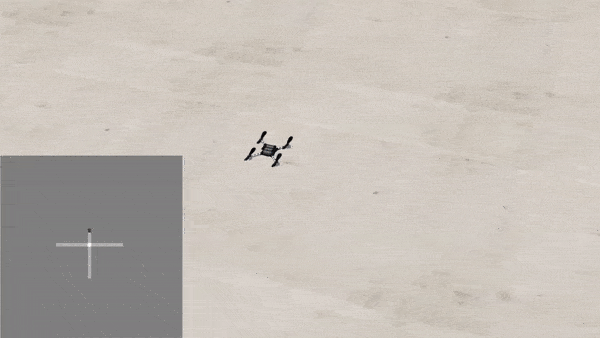

Examples
========

We provide you with an example on how to create an occupancy map.

Occupancy map
------------------
This is a simple occupancy grid algorithm based on distance measurements.
We loop through all four distance sensors, filling the occupancy map for each of them based on the following rules:
If an obstacle is detected, a conficdence value is subtracted, or added in case of a free cell.
If we don't have any information about that cell, it stays as it is.
At the end of the loop, we normalize the occupancy map to be between -1 and 1.
This resembles confidence about the occupancy of each cell and is more robust than just always filling in the last measurement.

The code for this algorithm is::

    global map, t
    pos_x = sensor_data['x_global']
    pos_y = sensor_data['y_global']
    yaw = sensor_data['yaw']
    
    for j in range(4): # 4 sensors
        yaw_sensor = yaw + j*np.pi/2 #yaw positive is counter clockwise
        if j == 0:
            measurement = sensor_data['range_front']
        elif j == 1:
            measurement = sensor_data['range_left']
        elif j == 2:
            measurement = sensor_data['range_back']
        elif j == 3:
            measurement = sensor_data['range_right']
        
        for i in range(int(range_max/res_pos)): # range is 2 meters
            dist = i*res_pos
            idx_x = int(np.round((pos_x - min_x + dist*np.cos(yaw_sensor))/res_pos,0))
            idx_y = int(np.round((pos_y - min_y + dist*np.sin(yaw_sensor))/res_pos,0))

            # make sure the point is within the map
            if idx_x < 0 or idx_x >= map.shape[0] or idx_y < 0 or idx_y >= map.shape[1] or dist > range_max:
                break

            # update the map
            if dist < measurement:
                map[idx_x, idx_y] += conf
            else:
                map[idx_x, idx_y] -= conf
                break
    
    map = np.clip(map, -1, 1) # certainty can never be more than 100%

    # only plot every Nth time step (comment out if not needed)
    if t % 50 == 0:
        plt.imshow(np.flip(map,1), vmin=-1, vmax=1, cmap='gray', origin='lower') # flip the map to match the coordinate system
        plt.savefig("map.png")
        plt.close()
    t +=1

    return map

This code can be found in **my_control.py** file.
Simulation results of this algorithm is shown in the following animation.
If the grid map is not shown automatically, you can open the 'map.png' file and see the animation in action.

