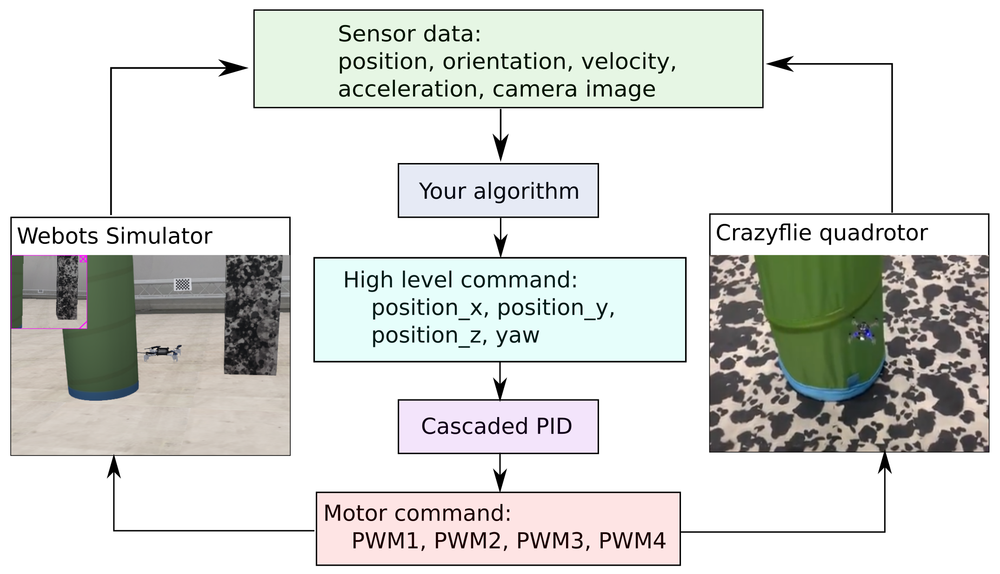

Project description
===================

In this graded project, you will learn how to program a Crazyflie to fly through course of gates as fast as possible.
In the first four weeks, all students have to individually perform a simulation task using the Webots simulator. 
In the remaining weeks of the course, all students will then compete as groups to compete for the fastes time on a real drone.

Simulation Task overview (individual work)
-------------------------

.. image:: arc_simulation.png
  :width: 650
  :alt: objective figure

The simulation arena is shown in the figure above. Your task is composed of multiple phases:

- The drone takes off from a take-off pad.
- In the first lap, the gate positions are unknown and have to be detected using computer vision methods (you may refer to OpenCV packages).
- In the second and third lap, you now know the gate positions and the drone has to fly through them as fast as possible.

Please note the following:

- The position of the take-off pad is fixed.
- The gate positions are randomly assigned. However, there will always be five gates arranged in a circle-like fashion which must be completed in counter clock-wise order. The gate centers are each located in piecewise circular sectors of 30 degrees as shown in the figure above.
- The clock starts when you leave the take-off region and stops when you enter it again.
- The origin and the coordinate system for your reference are indicated in the figure above. The Z coordinate is directed upwards (out of the page).
- A maximum time limit for your run in simulation is set at 240 seconds in real-time speed. Only the phases which you have completed up to this cutoff time will determine your grade for this task according to the metrics defined below.
- You may use the provided example function libarires under the *lib* subfolder and the code from previous exercises to assist your implementation. You may also adapt and tune the PID controller within the function *setpoint_to_pwm* under *ex1_pid_control.py*. 
- Grading will be done by evaluating your code on three random environments (but equal for all students) and according to the time you get when running the simulation in real-time.

Here is an example:

.. image:: sim_2025.gif
  :width: 650
  :alt: demo video in simulation

Your grade in this simulation exercise will be determined the following way: 

**Overall Grading:**

- We run your code on 3 randomly generated worlds (they are the same 3 used for everyone).
- Each world/map will be graded separately.
- Your final grade will be the average of your grades across all maps.

**Grading per Map:**

- You start with a grade of **3.5**. Then for each gate you pass through in lap 1, you get an additional 0.25 so you can reach a **max of 4.75**.
- For the remaining **1.25**, you are ranked first on total number of **gates missed in lap 1, 2, and 3** and then among students with the same number of missed gates, you're further ranked by your **average lap time**. From 0-17% percentile you get no additional points, 17-33% you get 0.25, and so on ...

Hardware Task overview (group work)
-----------------------

In the hardware task, you will later work towards transferring your algorithms from simulation onto the real Crazyflie hardware.
This time you work in a team of 4-5 people.

The hardware arena is similar in structure to the simulation arena but smaller. We will, however, tell you the position of the gates before the start of this task, so no need for computer vision in the Hardware task.

Your grade in this hardware exercise will be determined according to the same **Performance metrics** as in simulation. You will have three trials, the best one counts.

.. Here is a real-world test example of this project from last year:

.. .. image:: demo_2022.gif
..   :width: 650
..   :alt: demo video from last year

Final project grade
--------------------

The final project grade is composed of the following weighted average of both your grades in the simulation and hardware tasks:

**Final_grade = 0.5 * Simulation_grade + 0.5 * Hardware_grade**

System scheme
-------------
The data flow diagram for both the simulation and the real quadrotor is shown below.
Though they have the same types of sensory inputs and control outputs, your algorithm in simulation should be tuned in the real world in order to control the real drone.

Project schedule
----------------
The following table provides the schedule of the crazy-practical project.

==========================  ========================================================
**Week**                    **Notes**
| Week 6, March 25          | Project introduction, Simulation development, Q&A
| Week 7, April 1           | Simulation development, Q&A
| Week 8, April 8           | Simulation development, Q&A
| Week 9, April 15          | Simulation development, Q&A
                            | Simulation due 11:59 am (noon) April 29, submit code in Moodle
                            | Select the hardware group in Moodle
| Week 10, April 29         | Hardware introduction, pick up your drone by group
| Week 11, May 6            | Hardware development, Q&A
| Week 12, May 13           | Hardware development, Q&A
| Week 13, May 20           | Hardware development, Q&A
                            .. | Testing runs for hardware demonstrations (May 22nd)
| Week 14, May 26/27        | Submit hardware task video, Code and Presentation files (due May 26th 23:59)
                            | Hardware task presentation and final demonstrations, hand in the drones (May 27th)
==========================  ========================================================

Any questions about the task, submission, schedule and grading, please contact Charbel Toumieh (charbel.toumieh@epfl.ch).
