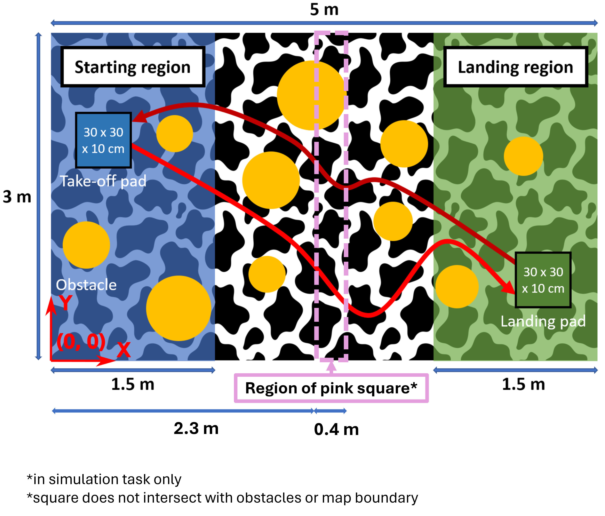
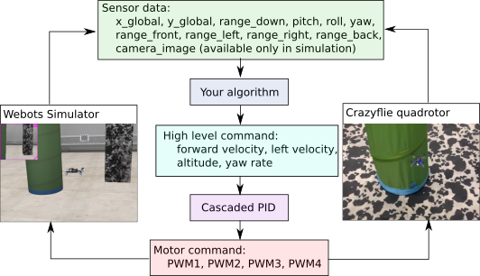

Project description
===================

In this graded project, you will learn how to program a Crazyflie to navigate through a field of obstacles and precisely land on a platform with the help of minimal sensory information.
In the first four weeks, all students have to individually perform a simulation task using the Webots simulator. 
In the remaining weeks of the course, all students will then compete as groups to complete an obstacle navigation task on the real drone.

Simulation Task overview
-------------------------

The simulation arena is shown in the figure above. Your task is composed of multiple phases:

- The drone takes off from a take-off pad placed within the starting region.
- Thanks to the optic-flow sensor and a downward-range finder the drone can track its movements and find the landing pad in the landing region.
- Once the landing pad is found, the drone has to precisely land on it.
- Upon successful landing, the drone takes off, flies back and lands on the take-off pad.
- In the whole arena, there will be a few obstacles of previously unknown dimensions which can be detected with the multiranger deck. Your developed algorithm should allow the drone to avoid any collisions.

To obtain a full score, in this simulation exercise, you will further make use of the camera onboard the Crazyflie:

- During flight towards the landing pad, a pink square at an arbitrary height will be featured in the arena. You should use the camera to detect the location of the pink square and pass through it.
- On the way back towards the starting region, the pink square will not be visible anymore and your algorithm should allow you to pass through the stored location of the pink square.

Please note the following:

- The center positions of the take-off and landing pads are randomly assigned within the respective starting and landing regions.
- The origin and the coordinate system for your reference are indicated in the figure above. The Z coordinate is directed upwards (out of the page).
- The pink square has dimensions of 0.4 x 0.4 x 0.1 meters and its center location is also randomly assigned within the pink region highlighted in the above figure.
- A maximum time limit for your run in simulation is set at 240 seconds. Only the phases which you have completed up to this cutoff time will determine your grade for this task according to the metrics defined below.

Your grade in this simulation exercise will be determined according to the following **Performance metrics**:

- **Grade 4.0**: Take off, avoid obstacles and reach the landing region whilst being airborne
- **Grade 4.5**: Land on the landing pad
- **Grade 5.0**: Take off from the landing pad and leave the landing region whilst being airborne
- **Grade 5.25**: Avoid obstacles and reach the starting region whilst being airborne
- **Grade 5.5**: Land on the take-off pad
- **Grade + 0.25**: Detect and pass through the pink square during flight from the starting region towards the landing region
- **Grade + 0.25**: Pass through the location of the pink square during flight from the landing region towards the starting region

Hardware Task overview
-----------------------

In the hardware task, you will work towards transfering your navigation algorithms from simulation onto the real Crazyflie hardware. You will not make use of the onboard camera in this exercise.  

You will again complete the following phases in a real drone arena containing randomly placed obstacles, take-off and landing pads:

- The drone takes off from a take-off pad placed within the starting region.
- Thanks to the optic-flow sensor and a downward-range finder the drone can track its movements and find the landing pad in the landing region.
- Once the landing pad is found, the drone has to precisely land on it.
- Upon successful landing, the drone takes off, flies back and lands on the take-off pad.
- In the whole arena, there will be a few obstacles of previously unknown dimensions which can be detected with the multiranger deck. Your developed algorithm should allow the drone to avoid any collisions.

Your goal in this task is to complete these phases in the least possible time. No pink square will be placed in the arena for this hardware task.

Your grade in this hardware exercise will be determined according to the following **Performance metrics**:

- **Grade 4.0**: Take off, avoid obstacles and reach the landing region whilst being airborne
- **Grade 4.5**: Land on the landing pad
- **Grade 5.0**: Take off from the landing pad and leave the landing region whilst being airborne
- **Grade 5.25**: Avoid obstacles and reach the starting region whilst being airborne
- **Grade 5.5**: Land on the take-off pad
- **Grade 5.5 + f(t)**: For students who complete the full task, extra grades will be based on the time taken to complete the task. The top 25% of students will receive a grade of f(t)=0.5, the next 50% will receive a grade of f(t)=0.25, and the bottom 25% will receive a grade of f(t)=0.

Here is a real-world test example of this project from last year:

.. image:: demo_2022.gif
  :width: 650
  :alt: demo video from last year

Final project grade
--------------------

The final project grade is composed of the following weighted average of both your grades in the simulation and hardware tasks:

**Final_grade = 0.7 * Simulation_grade + 0.3 * Hardware_grade**

System scheme
-------------
The data flow diagram for both the simulation and the real quadrotor is shown below. The sensor data values that are available in both simulation and hardware are listed. Note that on the real drone, you do not have access to the camera image.
Though your control output structure is the same, you will find that your algorithm in simulation should be tuned in the real world in order to control the real drone accurately.

Project schedule
----------------
The following table provides the schedule of the crazy-practical project.

==========================  ========================================================
**Week**                    **Notes**
| Week 6, March 26          | Project introduction, Simulation development, Q&A
| Week 7, April 9           | Simulation development, Q&A
| Week 8, April 16          | Simulation development, Q&A
| Week 9, April 23          | Simulation development, Q&A
                            | Simulation due 23:59 May 2, submit code in Moodle
                            | Select the hardware group in Moodle
| Week 10, April 30         | Hardware introduction, pick up your drone by group
| Week 11, May 7            | Hardware development, Q&A
| Week 12, May 14           | Hardware development, Q&A
| Week 13, May 21           | Hardware development, Q&A
| Week 14, May 28           | Hardware demonstrations, hand in the drones
==========================  ========================================================

Any questions about the task, submission, schedule and grading, please post on the forum. In case it is a private matter, please contact Charbel Toumieh (charbel.toumieh@epfl.ch).
