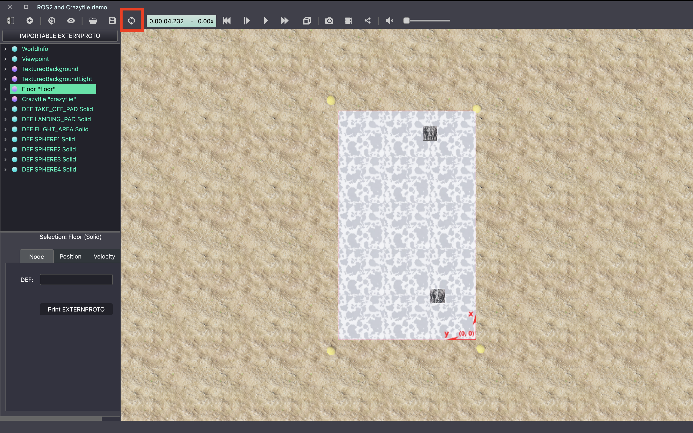

Exercise 0: Coordinate Transformations
==================================================
In this exercise, you will learn how to implement a coordinate transform for a drone using euler angles.
This will introduce you to Webots and help you to get familiar with some of the tools you will be using throughout the course.

Task Overview
-------------
For this task you will need to convert commands for a drone from the body frame to the inertial frame.
This is important because the drone's orientation will change as it moves, and the control commands need to be aligned with the drone's current orientation to ensure that it moves correctly.

To start, you can run the simulation in Webots by opening the world file (**crazyflie_world_exercise.wbt**) and clicking the play button.
To open the world file, click **File** -> **Open World** and select the **crazyflie_world_exercise.wbt** file from where you have saved this directory.
You should see a drone in the simulation that you can control using the keys on your keyboard as follows:
  - **W**: Move the drone forward
  - **S**: Move the drone backward
  - **A**: Move the drone left
  - **D**: Move the drone right
  - **Q**: Turn the drone left
  - **E**: Turn the drone right

By looking at the 3D view of the scene and the FPV camera from the drone, you can see that the drone moves in the inertial frame, regardless of its orientation.
(**Note**: The drone might not seem very stable, this is something you will improve in the exercise next week.)

This is because our controller from the drone assumes the commands are given in the inertial frame. This is useful for autonomous operations where the drone needs to move to a specific location in the world. 
However, sometimes we also want to control the drone relative to its own orientation. For example, if a human is piloting a drone remotely using an FPV camera, they will want to control the drone relative to the camera's orientation, not the world frame.

.. image:: before_transform.gif
  :width: 650
  :alt: Without the transformation the drone moves in the inertial frame regardless of its orientation

To fix this, you will need to implement a function to convert the control commands from the inertial frame to the body frame of the drone.
This will involve using the drone's current orientation, which is given as a set of Euler angles, to calculate a rotation matrix that can be used to transform the control commands.
If implemented correctly, the drone will then respond correctly to the control commands, regardless of its orientation and you can perform complex manouevres while yawing.

.. image:: after_transform.gif
  :width: 650
  :alt: When the rotation is implemented correctly the drone moves depending on its orientation

After making changes in the code you need to reload the world file in Webots to see the changes. This is done by clicking the **Reload World** button in the Webots interface.

Exercise
---------

1. Start by opening the **utils.py** file and locating the **euler2rotmat(euler_angs)** function. Implement the function to calculate the rotation matrix based on the given Euler angles. Remember, Euler angles represent roll, pitch, and yaw of the drone in the inertial frame.

2. Next, implement the **rot_body2inertial(control_commands, euler_angs)** function. Use the rotation matrix you obtained from **euler2rotmat(euler_angs)** to transform the velocity commands from the body frame to the inertial frame. This step is crucial for ensuring that the drone's movements are correctly aligned with its current orientation. You do not need to rotate the altitude command, just the horizontal velocity commands.

3. Test your implementation in the Webots simulation environment (**crazyflie_world_exercise**). You should observe that the drone can now be flown in the body frame, and that the control commands are correctly aligned with the drone's orientation.

Bonus challenge
---------------
To further test your skills, see if you can complete the same task using quaternions instead of Euler angles. 

Any questions about the exercise, please contact Benjamin Jarvis (benjamin.jarvis@epfl.ch).
