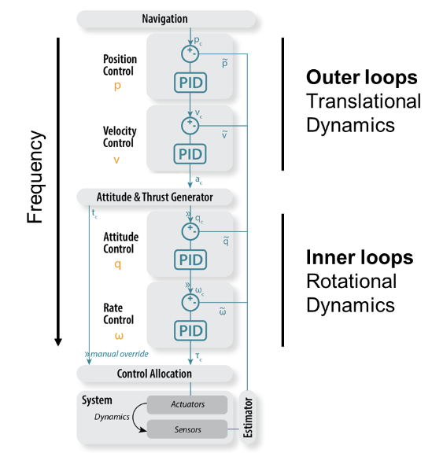
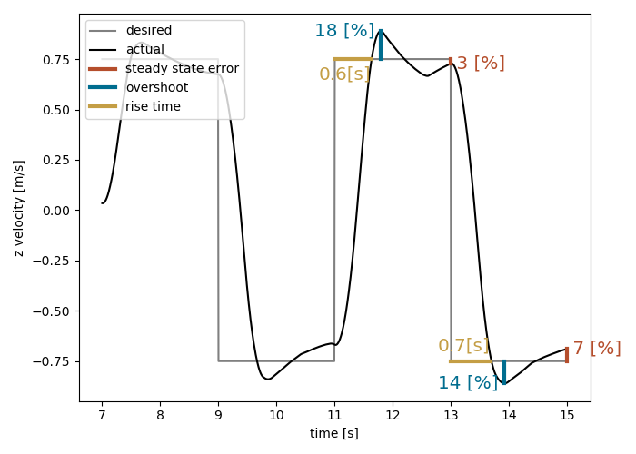
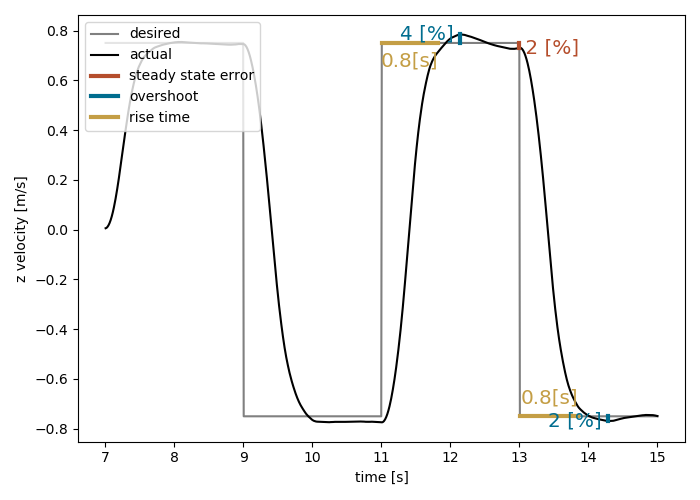

Exercise 1: Cascaded PID control
==================================

In this exercise, you will learn how to tune a cascaded PID controller for the CrazyFlie (**control.py**). 
As seen in the lecture, it takes a position and yaw setpoint as an input and generates pwm signals for the motors as output:

Task overview
-------------

For this task you will learn how to systematically tune each layer of the cascaded controller and thus improve the overall performance.
To start, make sure that you are in **main.py**, **exp_num = 1** and **control_style = "path_planner"**. You can now run the simulation on webots (**crazyflie_world_excercise**) and you should see a badly tuned controller flying through a parcour, marked by four spheres.
Note that webots tells you how long it takes the drone to complete the task: With the initial gains this is roughly 18 s. 

.. image:: square_before.gif
  :width: 650
  :alt: initial gains lead to bad performance
  :align: center

If tuned well, you will end up with a much better performance, completing the parcour below 12 s.

.. image:: square_after.gif
  :width: 650
  :alt: if tuned correclty, performance increases significantly
  :align: center

Exercise
---------
The key to a successful tuning is to start from a stable state: first you need to make sure that your drone can keep an altitude. This requires tuning the PID responsible for z-velocity as well as the one for z-position.
1. Start by opening **control.py** and change the variable **self.tuning_level = "vel_z"**.
This will now send step inputs for z-velocity to your drone. 
After two iterations, a plot displays the most important metrics for tuning:
  - Rise time: How long it takes the system to reach the reference. This should be as short as possible.
  - Overshoot: How much your system exceeds the reference after reaching it. This should stay within a certain range (we suggest less than 10%).
  - Steady state error: Your system might not converge fully to your reference within a period of the step function. This should stay within a certain range (we suggest less than 5%).

As a general rule of thumb, we propose the following strategy: 
- Start with a small P and I,D = 0.
- Increase P until you see an overshoot.
- Increase D until the overshoot vanishes (D is usually smaller than P).
- Repeat last two steps until increasing D does no longer stabilize your system and leads to oscillatory behaviour.
- Reduce P by 20% and adapt D accordingly. This ensures robust behaviour when operating in unforseen cases (e.g. roll and pitch at the same time).
- If nescessary, increase I to counteract steady state error: e.g. on "vel_z" to counteract gravity, or on "vel_xy" to counteract drag).

This should lead you to similar performance:

2. Now you can do the same for z-position by switching **self.tuning_level = "pos_z"**. Once you are done, your drone can hover in a stable manner, allowing tuning the other gains.
3. In a cascaded controller higher levels send references to lower ones. That's why you always tune from the bottom up.
- **self.tuning_level = "rate_rp"**
- **self.tuning_level = "rate_y"**
- **self.tuning_level = "att"**
- **self.tuning_level = "vel_xy"**
- **self.tuning_level = "vel_z"** (retuning might improve performance since lower levels have changed now)
- **self.tuning_level = "pos_xy"**
- **self.tuning_level = "pos_z"** (retuning might improve performance since lower levels have changed now)

Once you are happy with your gains, you can disable tuning (**self.tuning_level = "off"**).
Please send your gains and best time to **simon.jeger@epfl.ch** with the subject "exercise 1".
We will keep a live score board during the exercise session.

Bonus challenge
---------------
The references that are sent through the cascaded control architecture are capped to make your drone more stable (e.g. when you request a roll rate of 3 [rad/s], it still send a maximum reference of 2 [rad/s]).
For faster flight, you can increase the maximum reference by adapting **self.limits**. You might have to adjust your gains to adapt to the new limits.

Our best time is 9.5 s. Let the fastest drone win!

====================================================================================
Any questions about the exercise, please contact Simon Jeger (simon.jeger@epfl.ch).