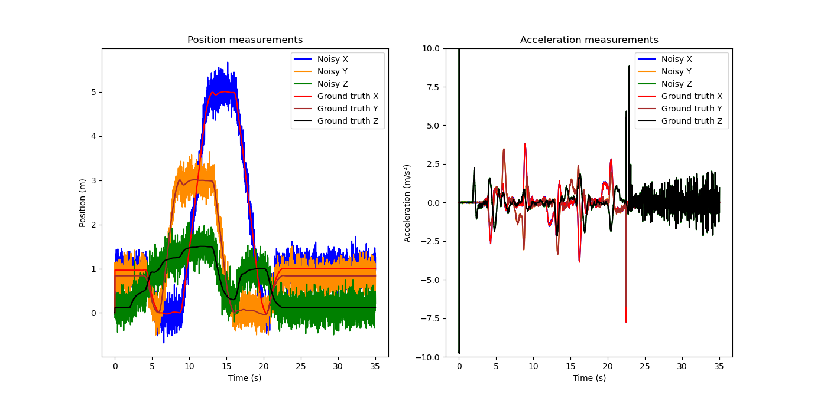
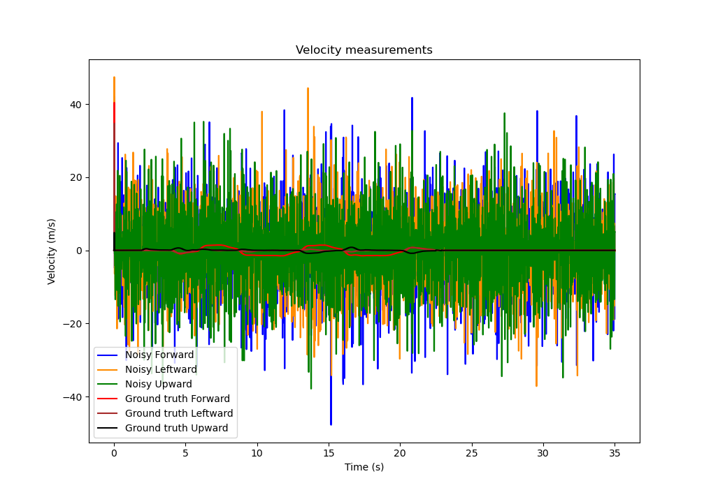
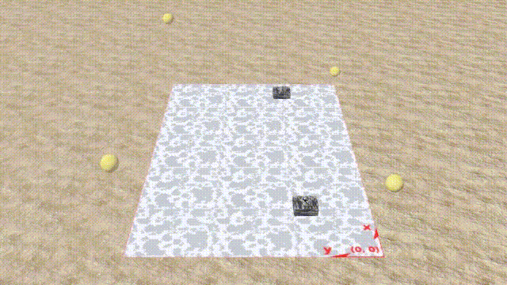
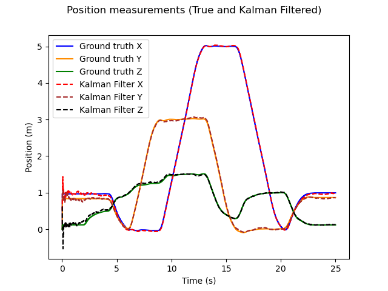
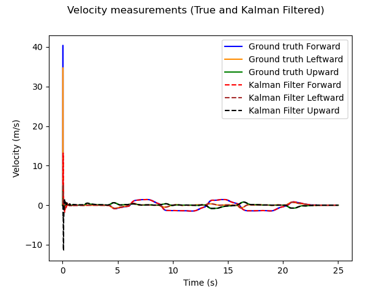
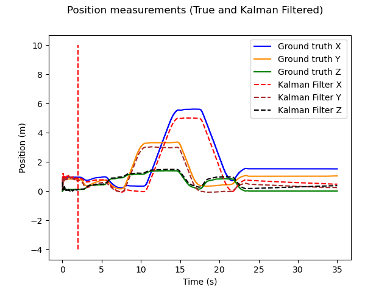

Exercise 2: Kalman Filtering
==================================

You have now already seen how to tune a cascaded PID controller to achieve accurate and fast waypoint flight with a quadrotor.
Up to this point, the measurement data that you have used for PID control feedback is the ground-truth (or noise-free) 
measurement which was sampled at every control step.

In reality, we are however faced with noisy sensor measurements and typically use a combination of mutliple sensors, each measuring different quantities with different noise levels at different time intervals, to obtain the state feedback for our controller.
This is where sensor fusion comes into play. As you have seen in the lecture, the Kalman Filter is a powerful and elegant sensor fusion technique that can both fuse measurements from different sensors and provide state estimates for control feedback at arbitrary time steps.
With this method, you will see that your quadrotor can stay on track in noisy, real world environments!

Task description
-----------------

In this task, you will implement a Kalman Filter in the file **ex2_kalman_filter.py** and explore how it can significantly improve the performance of a closed loop cascaded PID controller in a noisy real-world scenario.

Besides the Gyroscope, for this exercise, the Crazyflie drone is equipped with a GPS and an Accelerometer. 

These provide the following translational sensor measurements for your implementation:

- GPS: Global X,Y,Z position
- Accelerometer: Global X,Y,Z accelerations (are already transformed from body frame for you in this exercise)

Each of the sensors in the simulation and the PID controller furthermore run at the following individual update intervals:

- GPS: 24 milliseconds
- Accelerometer: 16 milliseconds
- PID Controller: 16 milliseconds

As we are considering real sensor data, the GPS and the Accelerometer measurements posess a so-called "Gaussian" noise with a 
certain standard deviation from the true measurement, defined respectively as std_GPS = 0.3 meters and std_ACCEL = 0.05 m/s².

(**Note**: These do not correspond to the typical update rates and noise variations of real-world sensors)

Let us first look at position and acceleration data obtained from these noisy measurements below:

.. FIGURE (Noisy position and acceleration)

To obtain the missing velocity measurements which are required for our PID controller, in a manner similar to the previous exercise, we can start by differentiating the noisy GPS position over every control interval. 
By comparing this estimate to the ground-truth velocity as shown below, we however observe that the velocity estimates are even noisier than the position measurements and far from accurate:

.. FIGURE (Figure of velocity noise)

When feeding these measurements directly into our cascaded PID controller, we then see the catastrophic results:

As you will see later in this exercise, relying on the integration of accleration measurements for the same purpose yields similarly unsatisfactory results.

Therefore, to remedy this problem, given the noisy GPS and Acclerometer measurements and using the provided theory from the lecture, you will implement a Kalman Filter that returns much better state estimates for three-dimensional position, velocity and acceleration, yielding better performance despite noise.
Your drone should then remain in flight throughout the parcours and you can modify process parameters to improve the performance of your controller with the Kalman Filter!

Exercise
---------

Part 1 - Implementation
------------------------
You will begin by implementing your Kalman Filer code in the file **ex2_kalman_filter.py**. 

The state prediction vector is represented by a 9 x 1 column vector and must be ordered as: 

[X Position, X Velocity, X Acceleration, Y Position, Y Velocity, Y Acceleration, Z Position, Z Velocity, Z Acceleration]

**Hint**: For matrix multiplications with two-dimensional numpy arrays, use numpy.matmul or the python operator "@" 

1. First, go to the function **initialize_KF** which initializes the Kalman Filter parameters. In this function:

  a) Initialize the optimal state estimate **self.X_opt** and prediction covariance **self.P_opt** with random finite values according to the tips given in the lecture (do not use infinite values).

  b) Define the sensor measurement matrices **self.H_GPS** and **self.H_ACCEL**.

  c) Given the measurement noise standard deviation inputs **noise_std_GPS** and **noise_std_ACCEL**, define the masurement uncertainty matrices **self.R_GPS** and **self.R_ACCEL**.

2. The function **KF_state_propagation** performs the propagation of the optimal state (**self.X_opt**) 
and optimal prediction covariance (**self.P_opt**) obtained at the time of the last sensor measurement over a specified time-interval **dt**. In this function:

  a) Given the propagation time **dt** as the function input, define the transition matrix **A_trans** for a particle with constant accleration as seen in the lecture.

  b) As described in the lecture, update both the values of the state prediction **X_pred** and prediction covariance **P_pred**, given the transition matrix **A_trans**, the provided process uncertainty matrix **Q_trans**, the previous optimal state **self.X_opt** and the optimal prediction covariance **self.P_opt**.

  c) Return **X_pred** and **P_pred**.

3. The function **KF_sensor_fusion** performs the fusion of sensor measurements and calculates the new **self.X_opt** and **self.P_opt** once a sensor measurement is received. In this function:

  a) Calculate the Kalman Filter gain **K** as seen in the lecture, given the input measurement matrix **H**, measurement uncertainty matrix **R**, the obtained measurement **Z**, the propagated state **X_pred** and propagated covariance **P_pred**.

  b) Implement the sensor fusion rule to update the new values of **self.X_opt** and **self.P_opt**.

4. The function **KF_estimate** returns the state estimate **X_est** and prediction covariance **P_est** when demanded by calling the state propagation and sensor fusion functions according to the latest received sensor measurement(s).

  In this function, the following inputs are provided:
    - **sensor_state_flag**: Indicates the measurement(s) obtained at the current timestep, can take the values: {0: No measurement received, 1: GPS measurement received, 2: Accelerometer measurement received, 3: GPS and Accelerometer measurement received simultaneousy}.
    - **dt_last_measurement**: The elapsed time since the latest received sensor measurement(s). 

  By calling the functions **KF_sensor_fusion** and **KF_state_propagation** and using **sensor_state_flag**, you should implement the followoing:

  a) Propagate the current optimal Kalman filter state by the provided input time interval **dt_last_measurement** to yield the propragated Kalman Filter state (**X_prop**) and prediction covariance estimates (**P_prop**).

  b) When either a GPS or an Accelerometer (but not both) measurements is received, using appropriate values for **R**, **H** and **Z** with the **KF_sensor_fusion** function, calculate and return the new optimal state (**self.X_opt**) and prediction covariance (**self.P_opt**).

  c) Return the final state and prediction covariance estimates depending on each case as **X_est** and **P_est**.

  When both measurements are received simultaneously, both measurements are fused sequentially. This case is provided to you as an example in the function.

To test your implementation, first set **self.use_direct_ground_truth_measurement = True** with all other flags set to false and compare your Kalman Filter estimate to the ground truth using the plots generated at the end of the run.
Your results should look similar to the plots below:

If you are happy with the filtering performance, run the PID controller with the activated noisy measurements and a running Kalman Filter. 
To do this, set **self.use_KF_measurement = True**, **self.use_direct_ground_truth_measurement = False**, **self.use_direct_noisy_measurement = False** and **self.use_accel_only = False**. 

**Note**: Ensure that you have pulled the latest version of **ex1_pid_control.py** with the correct PID gains commented as "KF gains and limits". These gains are less aggressive such that the drone can complete the parcours when using the Kalman Filter.

You should now see a smooth tracking performance. How do your run times compare to the case with ground truth feedback? 

.. image:: Figures/crazyflie_world_excercise_2_KF_success_new_PID.gif
  :width: 650
  :alt: Performance of drone parcours flight with Kalman Filter estimate
  :align: center

Observation: Check how the state estimate at the start of the trajectory takes several seconds to converge towards the ground truth value. This leads to the noticeable oscillations in flight bahavior when taking-off and when heading towards the first trajectory waypoint.
The use of better methods to initialize the Kalman filter, tuning the process covariance or de-tuning the aggressive gains of the PID controller during take-off can help to reduce these effects in real-life.

Part 2 - Relying on the Accelerometer 
-------------------------------------------

With the implemented Filter, let us look at what happens when we only measure and propagate accelerations from the 
acclerometer but do not correct our estimates with exact GPS measurements.

For this, within your implemented Kalman Filter class and **self.use_KF_measurement = True**, set **self.use_accel_only = True** and re-run the simulation.

Your drone movement should show a noticeable change after taking off, similar to this scenario:

.. image:: Figures/crazyflie_world_excercise_2_ACCEL_DRIFT.gif
  :width: 650
  :alt: Drone parcours flight with Kalman Filter estimate using only the accelerometer
  :align: center

A comparison of the ground truth and Kalman Filter estimate then looks like this:

What do you observe? Why does this happen?

As we only obtain accelerometer measurements but never correct our state estimate with a true (be it noisy) position estimate, the position and velocities are determined solely by integration of the accelerations.
The position and velocity estimates therefore "drift" away from the true value as the uncertainty becomes larger and larger over time. This is called sensor drift and is a commonly observed phenomenon when working with accelerometers.

Part 3 - Process Covariance Tuning (Bonus)
----------------------------------------------------------------------

A variable parameter of the Kalman Filter is the Process Covariance (**Q**). In our implementation, the process covariance is affected by the coefficient variable **self.q_tr**.
This parameter describes the uncertainty associated with the classical Kalman Filter assumption that the drone undergoes motions with constant acceleration over a single prediction timestep.

In simpler words:

  - If **self.q_tr = 0**, we assume that the drone undergoes motions which perfectly match the piecewise constant acclereration assumption. Therefore, the Kalman Filter will rely heavily on our model prediction to provide an accurate state estimate.

  - If **self.q_tr >> 0**, we assume that the drone undergoes motions which are different to the piecewise constant accleration assumption. Therefore, with a higher **self.q_tr**, the Kalman Filter will rely more heavily on the noisy sensor measurements to provide a more accurate state estimate.

Starting with **self.q_tr = 0**, increase **self.q_tr** by small increments and investigate how this affects the behavior of the drone in the parcours.
You can then keep tuning this coeffcient to find the lowest possible total run-time!

**Note:** There are more advanced methods to determine your process covariance. An ideal process covariance may for instance be calculated from the variance between the predicted and measured accelerations along the parcours.

====================================================================================
Any questions about the exercise, please contact Julius Wanner (julius.wanner@epfl.ch).